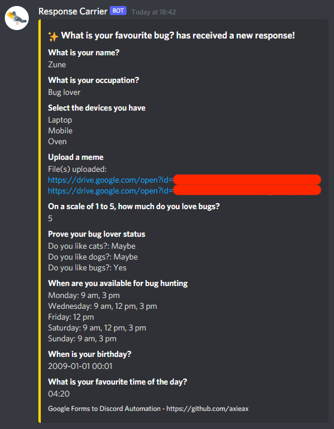

# Google Form responses to Discord automation

## Setting up a Google Form

1. Open a new or existing Google Form in edit mode.
2. Select Script Editor from the "..." dropdown in the top right corner.

3. Replace the code in the script editor with the contents of [script.js](script.js).
4. Enter a Project Name (i.e. Discord Webhook) and click Save (but do not close the script editor yet!).

## Create a Discord Webhook

Assumed: you have created a Discord account, joined a Discord server with the "Manage Webhooks" permmission enabled and there is at least one text channel (to display the notifications).

1. Navigate to Server Settings \> Integrations \> Webhooks \> Create Webhook. Select the channel you want the notifications to be pushed to.
2. Click "Copy Webhook URL".

## Link the Google Form to the Discord Webhook

1. In the script editor, paste the Webhook URL between the `"` symbols on [Line 11](https://github.com/axieax/google-forms-to-discord/blob/main/script.js#L11). You can optionally choose to hide responses in your notification by changing **false** to **true** on Line 13.
2. Click Save.
3. Open the Triggers menu from the left sidebar (below the current Editor mode).

4. Click "Add Trigger", and ensure the event type is set to "On form submit" for the "submitPost" function.
5. Click save and provide the required permissions to the workflow as prompted.

Congratulations, your automation is now set up!
